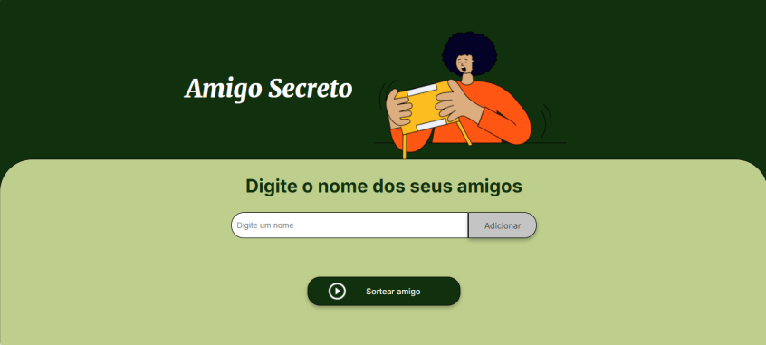
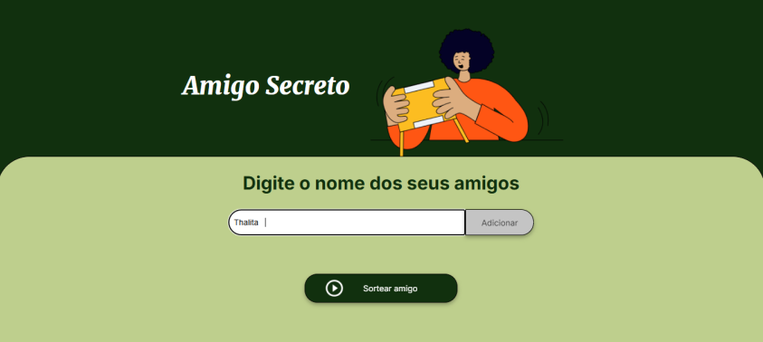
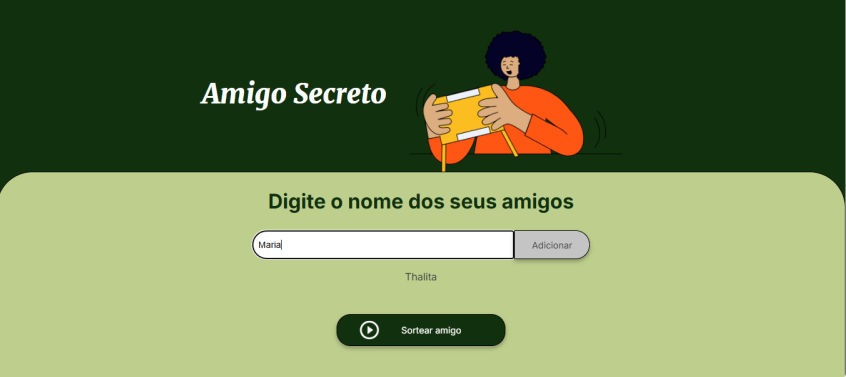
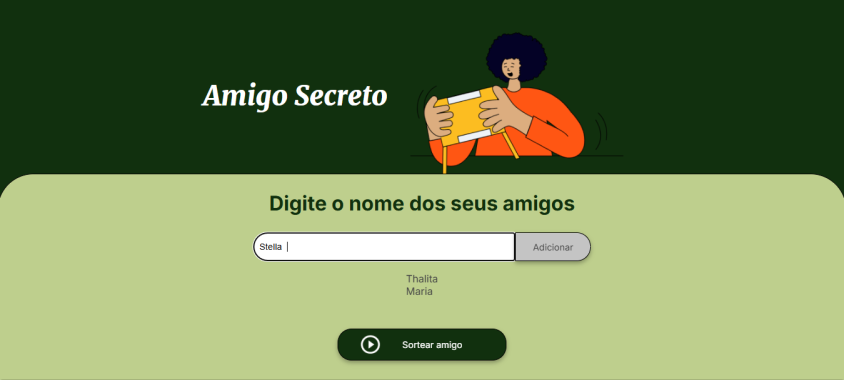

# Sorteador de Amigos 🎉

Este projeto é uma aplicação interativa desenvolvida com JavaScript, HTML e CSS, criada para facilitar a organização de sorteios entre amigos. Além de ser funcional, inclui uma animação comemorativa que torna a experiência mais divertida.

## Recursos Principais ✨

- **Adicionar Participantes**: Permite criar uma lista personalizada com os nomes dos amigos.
- **Validação Inteligente**: Impede a inserção de nomes inválidos ou duplicados.
- **Sorteio Único**: Seleciona aleatoriamente um amigo da lista, removendo-o após o sorteio para evitar repetições.
- **Efeitos Visuais**: Uma animação de celebração é exibida ao concluir o sorteio.
- **Atualização Dinâmica**: A lista é atualizada automaticamente conforme novos participantes são adicionados ou sorteados.

## Linguagens Utilizadas 💻

- **HTML**: Estrutura base da página.
- **CSS**: Estilos personalizados e animações.
- **JavaScript**: Responsável pela lógica do sorteio, validação e manipulação da lista.
- **Confetti.js**: Biblioteca para animações comemorativas.

## Como Usar 📋

1. Faça o download do projeto ou clone o repositório:
   ```bash
   git clone https://github.com/23Edu4rd0/challenge-amigo-secreto.git
   ```

2. Abra o arquivo `index.html` em qualquer navegador.

3. Siga as etapas abaixo:
   - No campo de entrada, insira o nome de um participante e clique em "Adicionar".
   - Veja o nome aparecer na lista de participantes.
   - Clique em "Sortear" para selecionar aleatoriamente um nome e celebrá-lo com confetes! 🎊
   - Repita o processo conforme necessário.

## Requisitos 🛠️

- Qualquer navegador moderno que suporte JavaScript.

## Estrutura do Projeto 📂

```plaintext
sorteador-de-amigos/
├── index.html        # Página principal do projeto
├── style.css         # Arquivo de estilo para a aplicação
├── app.js            # Código JavaScript com a lógica do sorteio
```

## Validações Implementadas ✅

- Impede o envio de nomes vazios ou duplicados.
- Bloqueia nomes com caracteres inválidos.
- Garante que pelo menos dois participantes estejam presentes antes do sorteio.

## Imagens 📸

##### Programa inicial


##### Adicionando nomes




##### Sorteio realizado


## Estrutura do Projeto 📂

```plaintext
sorteador-de-amigos/
├── index.html        # Página principal do projeto
├── style.css         # Arquivo de estilo para a aplicação
├── app.js            # Código JavaScript com a lógica do sorteio
```

## Validações Implementadas ✅

- Impede o envio de nomes vazios ou duplicados.
- Bloqueia nomes com caracteres inválidos.
- Garante que pelo menos dois participantes estejam presentes antes do sorteio.
